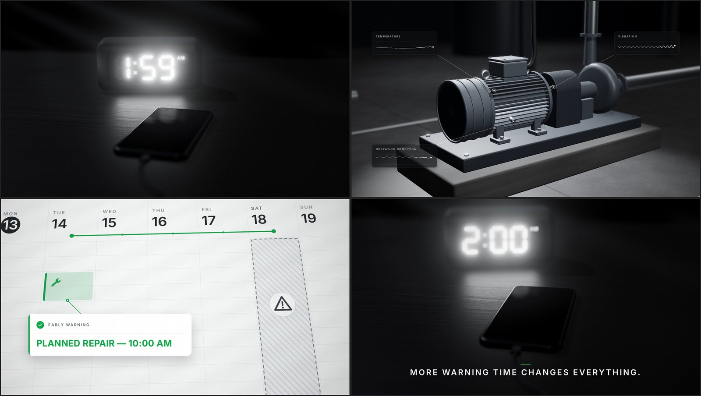

# The Midnight Phone Call That Never Happens

10-second horizontal social video for Reliable — 1920×1080, 16:9, 30 fps, no audio.

**File:** [`midnight-call_1920x1080_30fps.mp4`](midnight-call_1920x1080_30fps.mp4) (H.264 High, BT.709, yuv420p, faststart, no audio track)



## Beats

| Time | Shot |
| --- | --- |
| 0:00–0:02 | Bedside table at night. Clock reads **1:59 AM**; the phone beside it is dark. Slow push-in. |
| 0:02–0:05 | Rack-focus into a TEFC motor driving a pump. Vibration, temperature and operating-condition traces each develop a subtle change, then converge into one early-warning indicator. |
| 0:05–0:08 | The indicator becomes a work-order card on a daytime calendar: **EARLY WARNING** → **PLANNED REPAIR — 10:00 AM** (Reliable green) on Tuesday, four days before the projected failure on Saturday. |
| 0:08–0:10 | Cut back to the bedside. **1:59 → 2:00 AM**. Focus pulls to the phone — it stays dark. **MORE WARNING TIME CHANGES EVERYTHING.** |

Palette: black, dark grays, white, Reliable green `#11a84b`.

## Re-rendering

The video is generated in code (Three.js in headless Chromium, frames encoded with ffmpeg) — see [`source/`](source).

```bash
cd source
npm install            # three, Inter font, playwright
npx playwright install chromium   # if no Chromium is available
npm run render         # writes frames/f0000.png … f0299.png
npm run encode         # requires ffmpeg
```

Timing, copy and colors live in `source/src/` (`overlay.js` for on-screen text, `bedroom.js`, `motor.js`, `calendar.js` for the three sets).
